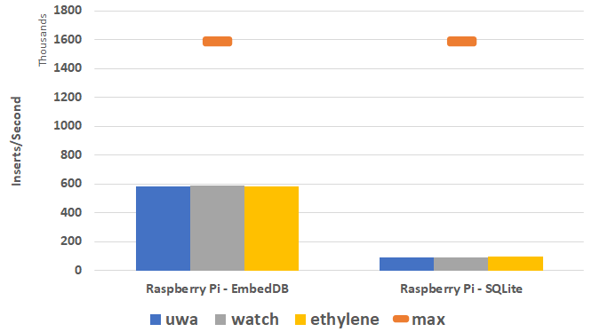
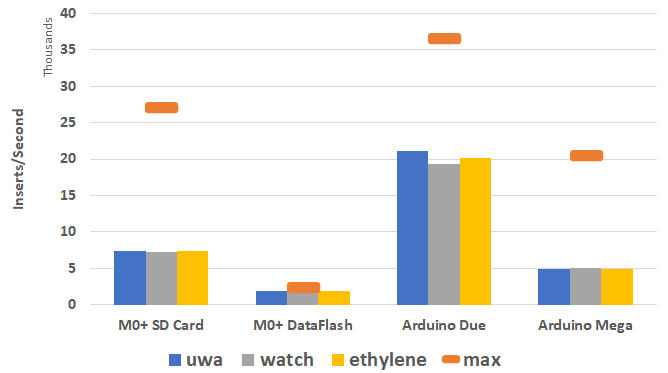
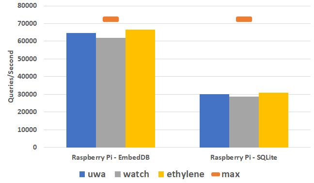
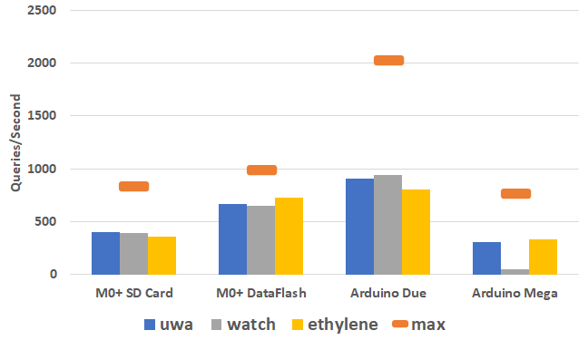
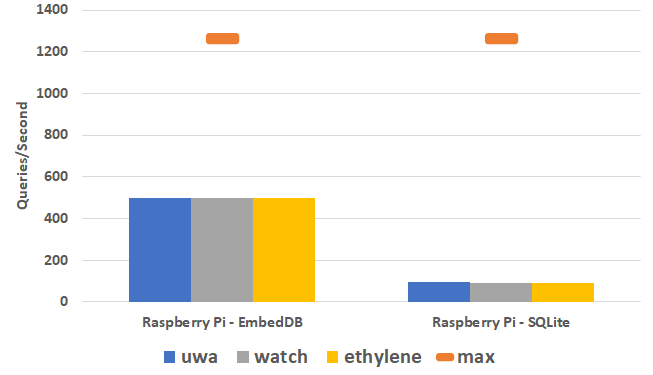
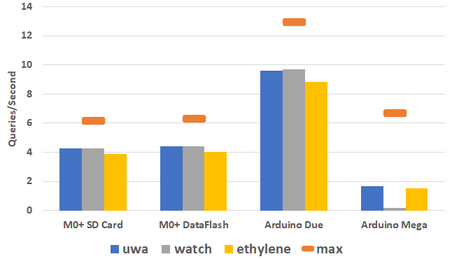
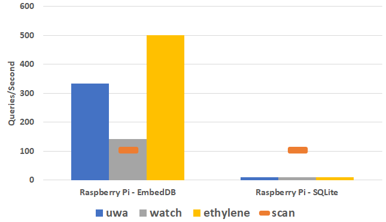
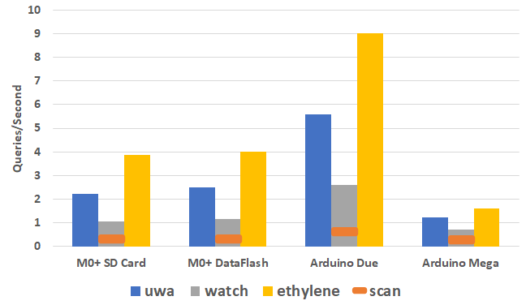
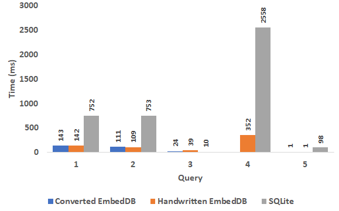

# Comparision of EmbedDB to SQLite

While SQLite is not really comparable to EmbedDB, there is no real other alternative that can run on the devices that EmbedDB can, so it is the closest popular system that we can compare to. In order to make the comparison, any graphs comparing SQLite and EmbedDB directly were run on a RaspberryPi 3 Model B so that there would be enough resources for SQLite to run. Graphs that do not directly compare directly to SQLite were run on various embedded devices. A summary of the hardware configurations used across these benchmarks is shown below.

<table>
    <tr>
        <td colspan=2></td>
        <td colspan=2 style="text-align: center">Reads (KB/s)</td>
        <td colspan=2 style="text-align: center">Writes (KB/s)</td>
        <td></td>
    </tr>
    <tr>
        <td>Device</td>
        <td>Storage</td>
        <td>Seq </td>
        <td>Random</td>
        <td>Seq </td>
        <td>Random</td>
        <td>Read-Write Ratio</td>
    </tr>
    <tr>
        <td>Raspberry Pi 3 Model B (4-core 1.2GHz, 1 GB RAM)</td>
        <td>SD Card</td>
        <td>167075</td>
        <td>36208</td>
        <td>25600</td>
        <td>25559</td>
        <td>1.42</td>
    </tr>
    <tr>
        <td>ARM Cortex M0+ SAMD21 (48MHz, 32KB RAM)</td>
        <td>SD Card</td>
        <td>483</td>
        <td>414</td>
        <td>435</td>
        <td>326</td>
        <td>1.27</td>
    </tr>
    <tr>
        <td>ARM Cortex M0+ SAMD21 (48MHz, 32KB RAM)</td>
        <td>DataFIash</td>
        <td>495</td>
        <td>491</td>
        <td>36</td>
        <td>37</td>
        <td>13.63</td>
    </tr>
    <tr>
        <td>Arduino Due (32-bit 84 MHz, 96KB RAM)</td>
        <td>SD Card</td>
        <td>980</td>
        <td>1011</td>
        <td>589</td>
        <td>579</td>
        <td>1.75</td>
    </tr>
    <tr>
        <td>Arduino Mega 2560 (8-bit 16MHz, 8KB RAM)</td>
        <td>SD Card</td>
        <td>409</td>
        <td>381</td>
        <td>330</td>
        <td>379</td>
        <td>1.00</td>
    </tr>
</table>

## Insert Performance

The insertion performance was measured on the hardware devices by inserting 100,000 records from the data sets. The performance is compared with the theoretical maximum performance of the device given its sequential write capability. The maximum performance is not achievable in practice as it does not consider any overheads related to CPU time or additional I/Os required for maintaining the data sets and associated indexes. However, it gives a metric for comparison since there are no comparable systems capable of running on these devices. The maximum performance is shown as an orange bar in the graphs. It is independent of the data set tested.

EmbedDB is compared with SQLite on the Raspberry Pi running Linux, which is the only test device capable of running SQLite. The throughput is measured in inserts per second with higher numbers being preferred.

#### RaspberryPi

#### Embedded Devices

## Query speed by key (Timestamp)

One of the most common queries is retrieving a record given its key such as the timestamp in a time series data set. Record retrieval by key was measured by performing 100,000 random key lookups on the data set created by inserting 100,000 records in the previous insert test. The theoretical maximum performance displayed on the charts is the expected throughput if the system performs 1 random I/O on the storage device and has no CPU overhead. This is the ideal case that is not practically achievable.

#### RaspberryPi

#### Embedded devices

## Key Range Retrieval

Performance on retrieving a range of keys is important for timestamp queries requiring a window of records between a start and end time. Key range performance was measured by a query requesting 5\% of the data set starting at a given key (timestamp). The performance of a key range query is impacted by how rapidly the system can find the starting key value using its index and then its scan performance to read the rest of the keys in the range. Since the keys are inserted in sorted order, sequential I/O should be performed once the starting key is found.

For comparison, the theoretical maximum is calculated as the time to scan 5\% of the data set ignoring the cost to find the first key value and any CPU processing required. Due to the query requiring both sequential and random I/O, the average of the sequential and random I/O speeds were used for the read speed. As in previous experiments, the theoretical maximum is an unachievable baseline used only for comparison.

#### RaspberryPi

#### Embedded devices

## Data Range Retrieval

A common query is retrieving records based on data value. For sensor applications, the time series data may measure environment information like temperature, humidity, air pressure, or sensor data such as X/Y/Z acceleration. These queries often search for outliers or points of interest in the time series, such as temperatures that are very high or low or significantly different than normal.

Data range retrieval is evaluated by providing a selective range of data values to retrieve. The range is chosen to return about 0.01\% of the data set. The selectivity determines the number of records retrieved and the performance of the approach.

The benchmark is the expected time to complete a scan of the data set. Unlike the previous theoretical benchmarks, this is not a theoretical maximum that is unachievable. Instead, the database should be able to improve upon using a full table scan to answer the query by using indexing on the data values.

#### RaspberryPi

#### Embedded devices

## SQL Query Performance

SQL queries are supported by EmbedDB's advanced query API allowing operations such as filtering, grouping, and aggregation. SQL queries can either be directly translated by the developer into EmbedDB's C API or developers can use the SQL translation tool to automatically generate the C code.

#### Queries

<table border="1" cellspacing="0" cellpadding="6" style="width:100%">
  <tr>
    <th>Query</th>
    <th>Speedup</th>
    <th>Query</th>
  </tr>
  <tr>
    <td><b>1</b></td>
    <td>5.36</td>
    <td>
		<b>Min, max, avg daily temperatures</b> 
		<small>SELECT key / 86400, min(temp), max(temp), avg(temp) FROM uwa GROUP BY key / 86400</small>
	</td>
  </tr>
  <tr>
    <td><b>2</b></td>
    <td>6.90</td>
    <td>
		<b>Avg. temp on days with wind speed > 15 mph</b> 
		<small>SELECT key / 86400, avg(temp), max(wind) FROM uwa GROUP BY key / 86400 HAVING max(wind) > 15</small>
	</td>
  </tr>
  <tr>
    <td><b>3</b></td>
    <td>2.66</td>
    <td>
		<b>Records with ethylene concentration > 0</b> 
		<small>SELECT COUNT(*) FROM ethylene WHERE conc > 0</small>
	</td>
  </tr>
  <tr>
    <td><b>4</b></td>
    <td>7.28</td>
    <td>
		<b>Compare temperatures at two weather stations in different years</b> 
		<small>SELECT u.key, s.temp as TempSEA, u.temp as TempUWA FROM sea s JOIN (SELECT key + 473385600 as key, temp FROM uwa) u ON s.key=u.key WHERE s.key >= 1420099200 AND s.key < 1451635200</small>
	</td>
  </tr>
  <tr>
    <td><b>5</b></td>
    <td>98</td>
    <td>
		<b>Count records with X motion above 500,000,000</b> 
		<small>SELECT key / 706000 as Bucket, COUNT(*) as Count FROM watch WHERE x > 500000000 GROUP BY key / 706000</small>
	</td>
  </tr>
</table>

#### Results on RaspberryPi

## Memory Usage

The memory used by EmbedDB was 2308 bytes: 200 bytes for state management, 20 bytes for file interface, 4 page buffers totaling 2048 bytes, and the key index of 40 bytes for the uwa data. Only the size of the key index is data set dependent. For ethylene it was 72 bytes, and watch was 2432 bytes.
